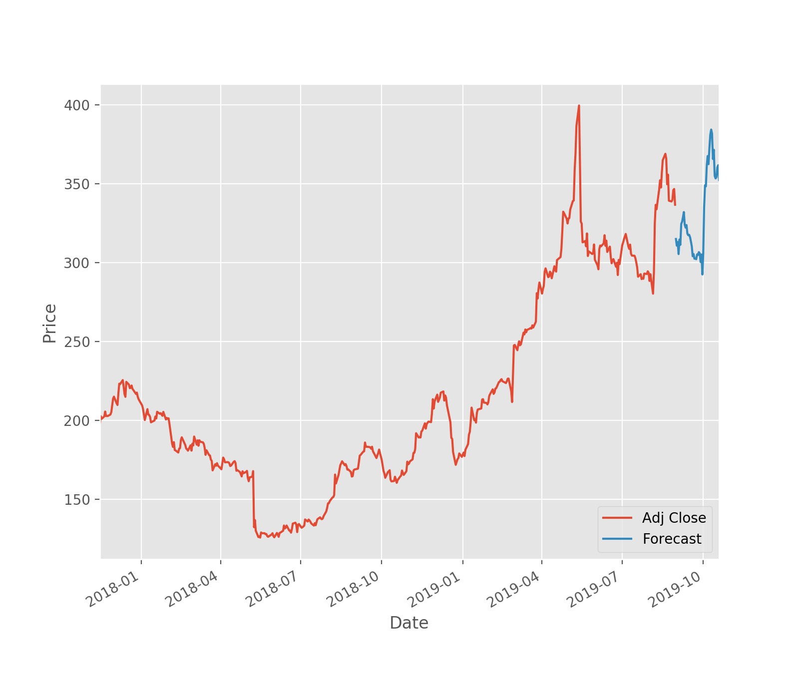

# Week 2 Stock prediction app using user auth boiler plate

[Exercisefile](./app/ml_main.py)
Main Exercise file under /app/ml_main.py

> Note: was not able to achive the integration of the main file with API to talk to frontend dashboard

##Outcomes for the main Excercise:

##Closer Snapshot of its prediction ability

Steps:

1. Use the exsting the boilerplate for the User Auth

2. Downlod the historic stock data from Yahoo finance

3. Using Scikit regression models build the stock prediction app

Q: Not able to see how we can only use Date as X and Y as the prediction column of Adj Close
Q: Does the prediction models always need a 2d array as when trying with only Date it failed with that error.

TODO's:
IMP: Need to improve what we need to predict based on what data.

1. Integrate the ml_main to the API call
2. Parameterize the training data set, with Company Name, 
    2.1 > start_time
    2.2 > end_time: will be default the yesterdays's date
    2.3 > Can be improved to select the company as well
3. Print the prediction plots on the HTML UI with all the four models with confidence rating
